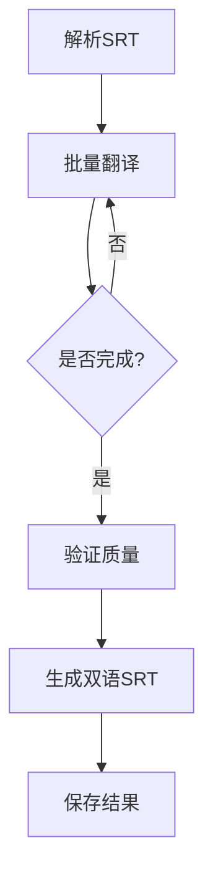

# 音频转SRT字幕工具 + LangGraph翻译Agent

基于Whisper模型的高质量音频转字幕工具，支持多种音频格式，提供针对不同硬件配置的优化方案。

**🆕 新增功能：LangGraph翻译Agent** - 基于LangGraph构建的智能翻译系统，将SRT字幕翻译为双语字幕，支持代理提供商配置。

## 🚀 快速开始

### 环境准备（使用uv）
```bash
# 安装uv (如果未安装)
pip install uv

# 安装音频转录依赖
uv add faster-whisper soundfile psutil

# 安装翻译Agent依赖
uv add langgraph langchain-openai

# 或使用pip
pip install faster-whisper soundfile psutil langgraph langchain-openai
```

### 🔑 环境变量配置（代理提供商）
```bash
# 设置环境变量（推荐）
export OPENAI_API_KEY=your_api_key
export MODEL_BASE_URL=https://your.proxy.com/v1  
export MODEL_NAME=gpt-4o-mini

# Windows PowerShell
$env:OPENAI_API_KEY="your_api_key"
$env:MODEL_BASE_URL="https://your.proxy.com/v1"
$env:MODEL_NAME="gpt-4o-mini"
```

### 基础用法

#### 📝 音频转录（步骤1）
```bash
# 转换英文音频
uv run python audio_to_srt.py your_video.mp4 -l en

# 转换中文音频  
uv run python audio_to_srt.py your_video.mp4 -l zh
```

#### 🌐 翻译为双语字幕（步骤2）
```bash
# 翻译SRT字幕（英文→中文）
uv run python srt_translator_agent.py your_video_20250629_155924.srt -s 英文 -t 中文

# 翻译为其他语言
uv run python srt_translator_agent.py input.srt -s 英文 -t 日语
```

#### 🚀 完整工作流（一键完成） - 推荐使用主控制脚本
```bash
# 🏆 方式1: 主控制脚本 (推荐)
uv run python main.py your_video.mp4 --mode full -l en -s 英文 -t 中文

# 🔧 方式2: 分步执行  
# 步骤1: 音频转录
uv run python audio_to_srt_optimized.py your_video.mp4 -l en --auto-config
# 步骤2: 双语翻译
uv run python srt_translator_agent.py str_file/your_video_*.srt -s 英文 -t 中文

# 📚 步骤3: 查看使用示例
uv run python main_example.py
```

### 优化版本（推荐）
```bash
# 快速系统检测
uv run python simple_test.py

# 自动检测最佳配置
uv run python audio_to_srt_optimized.py your_video.mp4 -l en --auto-config

# 详细系统测试
uv run python quick_test_optimized.py
```

## 🏆 主控制脚本 main.py

`main.py` 是推荐的主控制脚本，整合了音频转录和翻译功能，支持三种运行模式：

### 三种运行模式

| 模式 | 说明 | 输入 | 输出 | 适用场景 |
|------|------|------|------|----------|
| `full` | 完整工作流 | 音频/视频文件 | 双语SRT字幕 | 一键完成所有操作 |
| `transcribe` | 仅转录 | 音频/视频文件 | SRT字幕 | 只需要生成字幕 |
| `translate` | 仅翻译 | SRT文件 | 双语SRT字幕 | 已有字幕需要翻译 |

### 快速开始

```bash
# 🚀 完整工作流 (音频 → SRT → 双语字幕)
uv run python main.py your_video.mp4 --mode full -l en -s 英文 -t 中文

# 🎵 仅音频转录 (音频 → SRT)
uv run python main.py your_video.mp4 --mode transcribe -l en --auto-config

# 🌐 仅字幕翻译 (SRT → 双语字幕)
uv run python main.py your_subtitle.srt --mode translate -s 英文 -t 中文

# 🔍 验证配置 (空运行)
uv run python main.py your_video.mp4 --mode full -l en -s 英文 -t 中文 --dry-run
```

### 核心优势

- ✅ **统一参数配置**: 所有参数在一个地方设置
- ✅ **模式选择**: 灵活选择运行完整流程或单独功能
- ✅ **自动文件管理**: 智能处理文件路径和命名
- ✅ **配置验证**: 运行前验证所有依赖和配置
- ✅ **详细日志**: 实时显示处理进度和状态
- ✅ **错误处理**: 完善的错误处理和重试机制

### 主要参数

```bash
uv run python main.py INPUT [OPTIONS]

# 基础参数
--mode {full,transcribe,translate}    # 运行模式 (默认: full)

# 转录参数
-m, --whisper-model {tiny,base,small,medium,large-v3}  # Whisper模型
-l, --language en/zh                 # 语言代码
--compute-type {int8,float16,float32} # 计算精度
--cpu-threads 4                      # CPU线程数
--auto-config                        # 自动配置

# 翻译参数  
-s, --source-lang 英文               # 源语言
-t, --target-lang 中文               # 目标语言
--llm-model gpt-4o-mini              # LLM模型
-b, --batch-size 5                   # 批量大小

# 控制参数
-v, --verbose                        # 详细输出
-q, --quiet                          # 安静模式
--dry-run                            # 空运行验证
```

## 📁 文件结构和作用

### 🔧 核心脚本
| 文件 | 作用 | 适用场景 | 特色功能 |
|------|------|----------|----------|
| **`main.py`** | **🏆 主控制脚本** | **所有场景推荐** | **统一参数、三种模式、完整工作流** |
| `main_example.py` | 主脚本使用示例 | 学习和测试 | 交互式演示各种用法 |
| `audio_to_srt.py` | 基础音频转字幕 | 简单转换需求 | 标准Whisper实现，易于使用 |
| `audio_to_srt_optimized.py` | 优化版转换器 | 性能优化需求 | 内存监控、自动配置、int8精度 |
| `srt_translator_agent.py` | **LangGraph翻译Agent** | **双语字幕制作** | **状态图设计、批量翻译、错误重试** |
| `translation_example.py` | 翻译Agent示例 | 学习和测试 | 多种使用场景演示 |
| `simple_test.py` | 快速配置检测 | 首次使用 | 无阻塞，快速系统分析 |
| `quick_test_optimized.py` | 详细性能测试 | 深度测试 | 模型对比、性能监控 |

### 📚 文档文件
| 文件 | 内容 | 用途 |
|------|------|------|
| `README.md` | 项目总览和快速开始 | 了解项目概况 |
| `配置说明.md` | **代理提供商环境变量配置** | **设置API密钥和模型配置** |
| `批次大小优化指南.md` | **🆕 批次大小和LangGraph优化** | **解决递归限制和性能调优** |
| `系统优化指南.md` | 针对不同硬件的优化建议 | 性能调优参考 |
| `音频转字幕使用指南.md` | 详细使用说明和最佳实践 | 深入使用指南 |

### �� 输出目录
```
str_file/                              # 字幕文件目录
├── video_20250629_155924.srt         # 自动时间戳命名
├── lecture_20250629_160235.srt       # 避免覆盖之前的文件
├── Building_Ambient_Agents_OPTIMIZED_20250629_160512.srt  # 优化版本输出
└── Building_Ambient_Agents_QUICK_TEST_20250629_160745.srt # 测试输出
```

## ⚙️ 详细参数说明

### audio_to_srt.py 参数
```bash
uv run python audio_to_srt.py INPUT [OPTIONS]
```

| 参数 | 简写 | 默认值 | 说明 | 示例 |
|------|------|--------|------|------|
| `INPUT` | - | 必需 | 输入音频/视频文件路径 | `video.mp4` |
| `--output` | `-o` | 自动生成 | 输出SRT文件路径 | `-o output.srt` |
| `--model` | `-m` | `base` | Whisper模型大小 | `-m small` |
| `--language` | `-l` | 自动检测 | 指定语言代码 | `-l zh` 或 `-l en` |
| `--device` | `-d` | `cpu` | 计算设备 | `-d cuda` |
| `--compute-type` | - | `float32` | 计算精度 | `--compute-type int8` |
| `--batch` | - | False | 批量处理目录 | `--batch` |
| `--prompt` | - | 自动 | 初始提示词 | `--prompt "技术讲座"` |

### audio_to_srt_optimized.py 参数
```bash
uv run python audio_to_srt_optimized.py INPUT [OPTIONS]
```

| 参数 | 简写 | 默认值 | 说明 | 推荐值 |
|------|------|--------|------|--------|
| `INPUT` | - | 必需 | 输入音频文件 | - |
| `--output` | `-o` | 自动生成 | 输出文件路径 | - |
| `--model` | `-m` | 自动推荐 | 模型大小 | `base`(16GB内存) |
| `--language` | `-l` | 自动检测 | 语言代码 | `en`/`zh` |
| `--compute-type` | - | `int8` | **优化精度** | `int8`(推荐) |
| `--cpu-threads` | - | 自动 | CPU线程数 | `4`(集成显卡) |
| `--auto-config` | - | False | **自动配置** | `--auto-config` |
| `--prompt` | - | 自动 | 提示词 | 自动匹配语言 |

### srt_translator_agent.py 参数
```bash
uv run python srt_translator_agent.py INPUT [OPTIONS]
```

| 参数 | 简写 | 默认值 | 说明 | 示例 |
|------|------|--------|------|------|
| `INPUT` | - | 必需 | 输入SRT文件路径 | `video.srt` |
| `--output` | `-o` | 自动生成 | 输出文件路径 | `-o bilingual.srt` |
| `--source-lang` | `-s` | `英文` | 源语言 | `-s 英文` |
| `--target-lang` | `-t` | `中文` | 目标语言 | `-t 中文` |
| `--model` | `-m` | 环境变量 | LLM模型 | `-m gpt-4` |
| `--batch-size` | `-b` | `5` | 批量大小 | `-b 3` |
| `--api-key` | - | 环境变量 | API密钥 | `--api-key your_key` |

### 测试脚本参数
```bash
# 快速测试（无参数）
uv run python simple_test.py

# 详细测试（无参数）  
uv run python quick_test_optimized.py

# 翻译示例和环境检查
uv run python translation_example.py
```

## 🎯 模型和配置详解

### 模型大小对比
| 模型 | 文件大小 | 内存需求 | 处理速度 | 转录质量 | 推荐场景 |
|------|----------|----------|----------|----------|----------|
| `tiny` | 39MB | ~1-2GB | 最快 | 基础 | 快速预览、低配置系统 |
| `base` | 74MB | ~2-3GB | 快速 | 良好 | **日常使用推荐** |
| `small` | 244MB | ~4-5GB | 中等 | 很好 | 高质量需求 |
| `medium` | 769MB | ~6-8GB | 较慢 | 优秀 | 专业用途 |
| `large-v3` | 1550MB | ~10-12GB | 慢 | 最好 | 最高质量需求 |

### 计算精度对比
| 精度 | 内存使用 | 质量影响 | 兼容性 | 推荐场景 |
|------|----------|----------|--------|----------|
| `float32` | 100% | 最好 | 标准 | 内存充足时 |
| `float16` | ~50% | 很好 | 需GPU支持 | GPU加速 |
| `int8` | ~25% | 良好 | **最佳兼容** | **集成显卡推荐** |

### 语言代码参考
| 语言 | 代码 | 语言 | 代码 | 语言 | 代码 |
|------|------|------|------|------|------|
| 中文 | `zh` | 英文 | `en` | 日语 | `ja` |
| 韩语 | `ko` | 法语 | `fr` | 德语 | `de` |

## 🤖 LangGraph翻译Agent特性

### 核心优势
- 🏗️ **状态图设计**: 基于LangGraph的可视化工作流
- 🔄 **批量处理**: 智能批量翻译，提升效率
- 🛠️ **错误重试**: 自动重试机制，确保翻译完成
- 🌐 **多语言支持**: 支持多种语言对翻译
- ⚙️ **代理提供商**: 完美支持各种API代理服务
- 📝 **双语输出**: 生成标准双语SRT字幕

### 工作流节点


### 环境变量配置
| 变量名 | 必需 | 默认值 | 说明 |
|-------|------|--------|------|
| `OPENAI_API_KEY` | ✅ | - | API密钥 |
| `MODEL_BASE_URL` | ⚪ | 官方API | 代理基础URL |
| `MODEL_NAME` | ⚪ | `gpt-4o-mini` | 模型名称 |

详细配置说明请参考：[配置说明.md](配置说明.md)

## ❓ 常见问题解答

### 问题1: LangGraph递归限制错误
```
❌ 翻译失败: Recursion limit of 25 reached without hitting a stop condition
```

**解决方案**：我们已经修复了这个问题，代码中已包含 `recursion_limit: 100` 配置。如果仍有问题，请参考：[批次大小优化指南.md](批次大小优化指南.md)

### 问题2: 如何配置批次大小？
**答案**：通过 `-b` 或 `--batch-size` 参数指定：

```bash
# 高质量翻译（小批量）
uv run python main.py video.mp4 --mode full -b 2

# 平衡质量和速度（推荐）
uv run python main.py video.mp4 --mode full -b 3

# 快速处理（大批量）
uv run python main.py video.mp4 --mode full -b 5
```

详细优化指南：[批次大小优化指南.md](批次大小优化指南.md)

### 问题3: 代理提供商配置问题
**答案**：确保正确设置环境变量：

```bash
export OPENAI_API_KEY=your_api_key
export MODEL_BASE_URL=https://your.proxy.com/v1
export MODEL_NAME=gpt-4o-mini
```

### 问题4: 翻译质量不满意
**解决方案**：
1. 使用高级模型：`--llm-model gpt-4`
2. 减少批次大小：`-b 2`
3. 检查源语言和目标语言设置

### 支持的翻译语言对
- 英文 ↔ 中文
- 英文 ↔ 日语  
- 英文 ↔ 法语
- 中文 ↔ 英文
- 以及更多组合...

### Python API使用
```python
from srt_translator_agent import SRTTranslatorAgent

# 方式1: 使用环境变量（推荐）
agent = SRTTranslatorAgent()

# 方式2: 手动配置
agent = SRTTranslatorAgent(
    llm_model="gpt-4o-mini",
    api_key="your_key",
    base_url="https://your.proxy.com/v1"
)

# 执行翻译
output_file = agent.translate_srt(
    input_file="video.srt",
    source_lang="英文", 
    target_lang="中文"
)
```

## 🎯 完整工作流示例

### 从音频到双语字幕

#### 🏆 方式1: 主控制脚本 (推荐)
```bash
# 1. 配置环境变量
export OPENAI_API_KEY=your_key
export MODEL_BASE_URL=https://your.proxy.com/v1
export MODEL_NAME=gpt-4o-mini

# 2. 一键完成 (音频 → SRT → 双语字幕)
uv run python main.py lecture.mp4 --mode full -l en -s 英文 -t 中文 --auto-config
# 输出: str_file/lecture_YYYYMMDD_HHMMSS.srt (原始字幕)
#      str_file/lecture_YYYYMMDD_HHMMSS_bilingual_YYYYMMDD_HHMMSS.srt (双语字幕)

# 3. 查看使用示例
uv run python main_example.py
```

#### 🔧 方式2: 分步执行
```bash
# 1. 音频转录
uv run python audio_to_srt_optimized.py lecture.mp4 -l en --auto-config
# 或使用主脚本: uv run python main.py lecture.mp4 --mode transcribe -l en --auto-config

# 2. 翻译为双语字幕
uv run python srt_translator_agent.py str_file/lecture_20250629_155924.srt -s 英文 -t 中文
# 或使用主脚本: uv run python main.py str_file/lecture_20250629_155924.srt --mode translate -s 英文 -t 中文

# 3. 验证和测试
uv run python translation_example.py
```

### 批量处理多个文件

#### 🏆 使用主控制脚本 (推荐)
```bash
# 批量完整工作流 (音频 → 双语字幕)
for file in *.mp4; do
    echo "处理文件: $file"
    uv run python main.py "$file" --mode full -l en -s 英文 -t 中文 --auto-config
done

# 批量转录
for file in *.mp4; do
    uv run python main.py "$file" --mode transcribe -l en --auto-config
done

# 批量翻译
for srt in str_file/*.srt; do
    uv run python main.py "$srt" --mode translate -s 英文 -t 中文
done
```

#### 🔧 使用独立脚本
```bash
# 批量转录
for file in *.mp4; do
    uv run python audio_to_srt_optimized.py "$file" -l en --auto-config
done

# 批量翻译
for srt in str_file/*.srt; do
    uv run python srt_translator_agent.py "$srt" -s 英文 -t 中文
done
```

## 🔍 故障排除

### 代理提供商配置问题
1. **API密钥错误**: 检查 `OPENAI_API_KEY` 是否正确
2. **连接失败**: 验证 `MODEL_BASE_URL` 格式和网络
3. **模型不支持**: 尝试使用 `gpt-4o-mini`

### 翻译质量问题  
1. **空翻译**: 检查输入SRT格式是否正确
2. **翻译不准确**: 尝试使用更高级的模型(gpt-4)
3. **批量大小**: 减少 `--batch-size` 参数值

### 系统性能问题
1. **内存不足**: 运行 `simple_test.py` 检查配置
2. **转录缓慢**: 使用 `--auto-config` 自动优化
3. **模型加载失败**: 检查网络连接和存储空间

## 📊 项目特性总结

✅ **音频转录**: Whisper模型，多格式支持  
✅ **性能优化**: 针对不同硬件的优化方案  
✅ **智能翻译**: LangGraph状态图设计  
✅ **代理支持**: 完美支持各种API代理服务  
✅ **批量处理**: 支持批量音频转录和翻译  
✅ **时间戳命名**: 自动生成时间戳文件名  
✅ **质量保证**: 内置错误重试和质量验证  
✅ **双语输出**: 标准SRT双语字幕格式