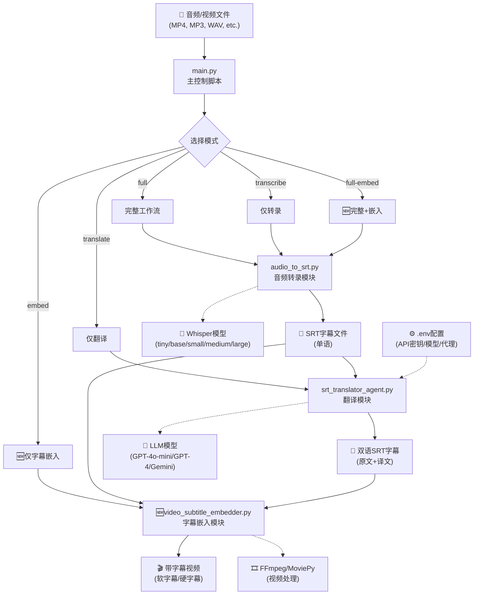

# 音频转双语字幕工具

简洁高效的音频转字幕工具，支持音频转录和字幕翻译，一键生成双语字幕。

## 🔄 功能结构图



## 🚀 快速开始

### 1. 安装依赖
```bash
# 使用 uv（推荐）
uv add faster-whisper soundfile psutil langgraph langchain-openai

# 或使用 pip
pip install faster-whisper soundfile psutil langgraph langchain-openai
```

### 2. 环境配置
复制 `.env_example` 文件并配置你的 API 密钥：

```bash
cp .env_example .env
```

编辑 `.env` 文件：
```bash
OPENAI_API_KEY=你的API密钥
MODEL_NAME=gpt-4o-mini  # 或其他模型
MODEL_BASE_URL=https://your.proxy.com/v1  # 如果使用代理
```

### 3. 一键运行
```bash
# 完整流程：音频 → SRT字幕 → 双语字幕
uv run main.py your_video.mp4 --mode full -l en -s 英文 -t 中文

# ⚠️ 长字幕提醒：如果字幕超过500条，建议使用 -b 15 或更大的批量大小
uv run main.py long_video.mp4 --mode full -l en -s 英文 -t 中文 -b 15
```

## 📁 核心文件说明

### 1. `main.py` - 主控制脚本 🏆
**功能：** 统一的入口点，支持五种运行模式

**五种模式：**
- `full` - 完整工作流（音频 → SRT → 双语字幕）
- `transcribe` - 仅音频转录（音频 → SRT）
- `translate` - 仅字幕翻译（SRT → 双语字幕）
- `embed` - 🆕 仅字幕嵌入（视频 + SRT → 带字幕视频）
- `full-embed` - 🆕 完整工作流+嵌入（音频 → SRT → 双语字幕 → 带字幕视频）

### 2. `audio_to_srt.py` - 音频转录模块
**功能：** 使用 Whisper 模型将音频转换为 SRT 字幕

### 3. `srt_translator_agent.py` - 翻译模块
**功能：** 基于 LangGraph 的智能翻译 Agent，将单语字幕转换为双语字幕

### 4. `video_subtitle_embedder.py` - 🆕 字幕嵌入模块
**功能：** 将SRT字幕嵌入到视频文件，支持软字幕和硬字幕两种模式
- 🚀 **FFmpeg优先**：系统FFmpeg处理，速度最快
- 📦 **MoviePy降级**：自动降级兼容，无需手动安装FFmpeg
- 🎨 **样式配置**：5种预设样式，支持自定义

### 5. `subtitle_styles.json` - 🆕 字幕样式配置
**功能：** 字幕样式预设配置文件
- `default` - 默认白色字幕，黑色边框
- `cinema` - 电影院风格黄色字幕
- `simple` - 简洁白色字幕，无边框
- `elegant` - 优雅浅灰色字幕
- `bright` - 青色字幕，适合深色背景

## 🔧 使用方法

### 方式1：使用主控制脚本（推荐）

#### 完整工作流
```bash
# 英文音频 → 中文双语字幕
uv run main.py video.mp4 --mode full -l en -s 英文 -t 中文

# 中文音频 → 英文双语字幕  
uv run main.py video.mp4 --mode full -l zh -s 中文 -t 英文
```

#### 🆕 完整工作流+字幕嵌入（一键到底）
```bash
# 英文视频 → 转录 → 翻译 → 嵌入双语字幕（推荐）
uv run main.py video.mp4 --mode full-embed -l en -s 英文 -t 中文

# 选择嵌入原始字幕（仅英文）
uv run main.py video.mp4 --mode full-embed -l en --subtitle-choice original

# 使用硬字幕（兼容性更好）
uv run main.py video.mp4 --mode full-embed -l en -s 英文 -t 中文 --embed-type hard

# 使用电影院样式
uv run main.py video.mp4 --mode full-embed -l en -s 英文 -t 中文 --style-preset cinema
```

#### 🆕 仅字幕嵌入
```bash
# 自动查找并嵌入双语字幕（最常用）
uv run main.py video.mp4 --mode embed

# 指定字幕文件嵌入
uv run main.py video.mp4 --mode embed --srt-file subtitle.srt

# 选择嵌入纯翻译字幕
uv run main.py video.mp4 --mode embed --subtitle-choice translation

# 强制使用MoviePy处理器
uv run main.py video.mp4 --mode embed --processor moviepy
```

#### 仅音频转录
```bash
# 转录英文音频
uv run main.py video.mp4 --mode transcribe -l en

# 转录中文音频
uv run main.py video.mp4 --mode transcribe -l zh
```

#### 仅字幕翻译
```bash
# 翻译现有字幕文件
uv run main.py existing.srt --mode translate -s 英文 -t 中文
```

### 方式2：单独运行各模块

#### 单独运行音频转录
```bash
# 基础转录
uv run audio_to_srt.py video.mp4 -l en

# 指定模型和输出文件
uv run audio_to_srt.py video.mp4 -l en -m base -o output.srt
```

#### 单独运行字幕翻译
```bash
# 基础翻译
uv run srt_translator_agent.py input.srt -s 英文 -t 中文

# 指定批量大小和输出文件
uv run srt_translator_agent.py input.srt -s 英文 -t 中文 -b 3 -o output.srt
```

#### 🆕 单独运行字幕嵌入
```bash
# 基础嵌入（软字幕，默认样式）
uv run video_subtitle_embedder.py video.mp4 subtitle.srt

# 指定输出文件和嵌入类型
uv run video_subtitle_embedder.py video.mp4 subtitle.srt -o output.mp4 --embed-type hard

# 指定样式和处理器
uv run video_subtitle_embedder.py video.mp4 subtitle.srt --style cinema --processor ffmpeg

# 批量处理（目录中的所有视频+字幕）
uv run video_subtitle_embedder.py video_dir/ subtitle_dir/ --batch --embed-type soft
```

## ⚙️ 参数说明

### main.py 参数
```bash
uv run main.py INPUT [OPTIONS]

必需参数：
  INPUT                    输入文件（音频/视频/SRT文件）

基础选项：
  --mode {full,transcribe,translate,embed,full-embed}  运行模式（默认：full）
  -l, --language {en,zh,ja,ko,fr,de}  音频语言（转录时需要）
  -s, --source-lang TEXT   源语言（翻译时需要，如：英文）
  -t, --target-lang TEXT   目标语言（翻译时需要，如：中文）

音频转录选项：
  -m, --whisper-model {tiny,base,small,medium,large-v3}  Whisper模型
  --compute-type {int8,float16,float32}  计算精度（默认：int8）
  --cpu-threads INT        CPU线程数（默认：4）

翻译选项：
  --llm-model TEXT         LLM模型（默认从环境变量读取）
  -b, --batch-size INT     翻译批量大小（默认：5）
  --api-key TEXT          API密钥（覆盖环境变量）
  --base-url TEXT         API基础URL（覆盖环境变量）

🆕 字幕嵌入选项：
  --subtitle-choice {original,translation,bilingual}  字幕类型（默认：bilingual）
  --embed-type {soft,hard}    嵌入方式（默认：soft）
  --style-preset TEXT        样式预设（默认：default）
  --processor {auto,ffmpeg,moviepy}  处理器选择（默认：auto）
  --srt-file TEXT            指定字幕文件（embed模式使用）

控制选项：
  -v, --verbose           详细输出
  -q, --quiet            安静模式
  --dry-run              验证配置但不执行
```

### audio_to_srt.py 参数
```bash
uv run audio_to_srt.py INPUT [OPTIONS]

必需参数：
  INPUT                    音频文件路径

选项：
  -o, --output TEXT       输出SRT文件路径
  -m, --model TEXT        Whisper模型（默认：base）
  -l, --language TEXT     语言代码（如：en, zh）
  -d, --device TEXT       设备（默认：cpu）
  --compute-type TEXT     计算精度（默认：float32）
  --prompt TEXT           初始提示词
  --batch                 批量处理目录
```

### srt_translator_agent.py 参数
```bash
uv run srt_translator_agent.py INPUT [OPTIONS]

必需参数：
  INPUT                    SRT文件路径

选项：
  -o, --output TEXT       输出文件路径
  -s, --source-lang TEXT  源语言（如：英文）
  -t, --target-lang TEXT  目标语言（如：中文）
  -m, --model TEXT        LLM模型
  -b, --batch-size INT    批量大小（默认：5）
  --api-key TEXT          API密钥
```

### 🆕 video_subtitle_embedder.py 参数
```bash
uv run video_subtitle_embedder.py VIDEO SUBTITLE [OPTIONS]

必需参数：
  VIDEO                   输入视频文件路径
  SUBTITLE                输入SRT字幕文件路径

选项：
  -o, --output TEXT       输出视频文件路径
  --embed-type {soft,hard}  嵌入类型（默认：soft）
  --style TEXT            样式预设（默认：default）
  --processor {auto,ffmpeg,moviepy}  处理器选择（默认：auto）
  --batch                 批量处理模式
  -v, --verbose           详细输出
```

## 🎯 模型配置指南

### Whisper模型规模对比
| 模型 | 文件大小 | 内存需求 | 处理速度 | 转录质量 | 推荐场景 |
|------|----------|----------|----------|----------|----------|
| `tiny` | 39MB | ~1-2GB | 最快 | 基础 | 快速预览、低配置系统 |
| `base` | 74MB | ~2-3GB | 快速 | 良好 | **日常使用推荐** |
| `small` | 244MB | ~4-5GB | 中等 | 很好 | 高质量需求 |
| `medium` | 769MB | ~6-8GB | 较慢 | 优秀 | 专业用途 |
| `large-v3` | 1550MB | ~10-12GB | 慢 | 最好 | 最高质量需求 |

### 计算精度对比
| 精度 | 内存使用 | 质量影响 | 兼容性 | 推荐场景 |
|------|----------|----------|--------|----------|
| `float32` | 100% | 最好 | 标准 | 内存充足时 |
| `float16` | ~50% | 很好 | 需GPU支持 | GPU加速 |
| `int8` | ~25% | 良好 | **最佳兼容** | **集成显卡推荐** |

### 🚀 CUDA加速配置

#### 方法1：修改 audio_to_srt.py（单独运行时）
```bash
# 编辑 audio_to_srt.py，找到第35行左右的设备配置
# 将 device="cpu" 改为 device="cuda"
uv run audio_to_srt.py video.mp4 -l en -d cuda --compute-type float16
```

#### 方法2：修改 main.py（推荐）
在 `main.py` 中找到 `transcribe_audio` 方法（约第100行），将：
```python
model = faster_whisper.WhisperModel(
    model_size_or_path=model_size,
    device="cpu",  # 改为 "cuda"
    compute_type=compute_type,
    cpu_threads=cpu_threads
)
```

**CUDA配置建议：**
- **GPU内存 >= 4GB**：使用 `device="cuda"` + `compute_type="float16"`
- **GPU内存 >= 8GB**：使用 `device="cuda"` + `compute_type="float32"`
- **GPU内存不足**：保持 `device="cpu"` + `compute_type="int8"`

#### 验证CUDA可用性
```python
# 在Python中测试
import torch
print(f"CUDA可用: {torch.cuda.is_available()}")
print(f"CUDA设备数: {torch.cuda.device_count()}")
if torch.cuda.is_available():
    print(f"GPU名称: {torch.cuda.get_device_name(0)}")
    print(f"GPU内存: {torch.cuda.get_device_properties(0).total_memory / 1024**3:.1f}GB")
```

### 性能优化建议

#### 低配置系统（内存 < 8GB）
```bash
# 使用最小模型和优化精度
uv run main.py video.mp4 --mode full -l en -s 英文 -t 中文 \
  -m tiny --compute-type int8 --cpu-threads 2 -b 2
```

#### 中等配置系统（内存 8-16GB）
```bash
# 平衡质量和性能
uv run main.py video.mp4 --mode full -l en -s 英文 -t 中文 \
  -m base --compute-type int8 --cpu-threads 4 -b 3
```

#### 高配置系统（内存 > 16GB + GPU）
```bash
# 最高质量配置（需要修改代码启用CUDA）
uv run main.py video.mp4 --mode full -l en -s 英文 -t 中文 \
  -m large-v3 --compute-type float16 --cpu-threads 8 -b 5
```

#### 长字幕处理（> 500条字幕）
```bash
# 大批量配置，避免递归限制问题
uv run main.py video.mp4 --mode full -l en -s 英文 -t 中文 \
  -m base --compute-type int8 -b 15

# 超长字幕配置（> 1000条）
uv run main.py video.mp4 --mode full -l en -s 英文 -t 中文 \
  -m base --compute-type int8 -b 25
```

## 📊 输出文件

### 文件命名规则
- 转录输出：`原文件名_YYYYMMDD_HHMMSS.srt`（原始字幕）
- 翻译输出：`原文件名_translation_YYYYMMDD_HHMMSS.srt`（纯翻译字幕）
- 双语输出：`原文件名_bilingual_YYYYMMDD_HHMMSS.srt`（双语字幕）

### 输出目录
```
srt_file/                           # 自动创建的输出目录
├── video_20250629_172654.srt      # 原始字幕
├── video_translation_20250629_172720.srt  # 纯翻译字幕
└── video_bilingual_20250629_172720.srt    # 双语字幕
```

### 三种字幕格式说明

#### 原始字幕格式（转录输出）
```
1
00:00:01,000 --> 00:00:03,000
Hello, welcome to our presentation.

2
00:00:03,000 --> 00:00:06,000
Today we will discuss...
```

#### 纯翻译字幕格式（翻译输出）
```
1
00:00:01,000 --> 00:00:03,000
你好，欢迎观看我们的演示。

2
00:00:03,000 --> 00:00:06,000
今天我们将讨论...
```

#### 双语字幕格式（双语输出）
```
1
00:00:01,000 --> 00:00:03,000
Hello, welcome to our presentation.
你好，欢迎观看我们的演示。

2
00:00:03,000 --> 00:00:06,000
Today we will discuss...
今天我们将讨论...
```

## 🔍 常见使用场景

### 场景1：处理英文教学视频
```bash
# 一键生成中英双语字幕
uv run main.py lecture.mp4 --mode full -l en -s 英文 -t 中文
```

### 场景2：处理中文音频
```bash
# 转录中文音频为字幕
uv run main.py audio.mp3 --mode transcribe -l zh
```

### 场景3：翻译现有字幕
```bash
# 将现有英文字幕翻译为双语
uv run main.py subtitles.srt --mode translate -s 英文 -t 中文
```

### 场景4：批量处理
```bash
# 批量处理多个文件
for file in *.mp4; do
    uv run main.py "$file" --mode full -l en -s 英文 -t 中文
done
```

### 场景5：长字幕处理（重要）
```bash
# 中等长度字幕（500-1000条）
uv run main.py long_lecture.mp4 --mode full -l en -s 英文 -t 中文 -b 15

# 超长字幕（>1000条）- 避免递归限制
uv run main.py very_long_video.mp4 --mode full -l en -s 英文 -t 中文 -b 25

# 极长字幕处理 - 同时修改代码中的recursion_limit
uv run main.py extremely_long.mp4 --mode full -l en -s 英文 -t 中文 -b 30
```

## 🎬 字幕嵌入功能详解

### 📊 处理器对比

| 特性 | 系统 FFmpeg 🚀 | MoviePy 📦 |
|------|----------------|-------------|
| **处理速度** | 极快（几秒钟） | 较慢（几分钟） |
| **内存使用** | 低 | 高 |
| **安装复杂度** | 需要单独安装 | pip一键安装 |
| **软字幕支持** | ✅ 完美支持 | ❌ 不支持 |
| **硬字幕支持** | ✅ 完美支持 | ✅ 支持 |
| **样式自定义** | ✅ 丰富 | ⚪ 基础 |
| **错误处理** | 需要解析命令行 | Python异常 |

### 📋 字幕类型说明

| 类型 | 描述 | 优势 | 劣势 | 推荐场景 |
|------|------|------|------|----------|
| **软字幕** | 字幕作为独立轨道嵌入 | 文件小、可开关、速度快 | 兼容性稍差 | **推荐默认** |
| **硬字幕** | 字幕烧录到视频画面 | 兼容性好、永久显示 | 文件大、不可关闭 | 分享和播放 |

### 🎨 样式预设效果

```bash
# 预览所有样式
uv run main.py video.mp4 --mode embed --style-preset default    # 白色字幕，黑边框
uv run main.py video.mp4 --mode embed --style-preset cinema     # 黄色字幕，电影风格
uv run main.py video.mp4 --mode embed --style-preset simple     # 简洁白色，无边框
uv run main.py video.mp4 --mode embed --style-preset elegant    # 优雅浅灰，专业感
uv run main.py video.mp4 --mode embed --style-preset bright     # 青色字幕，亮眼效果
uv run main.py video.mp4 --mode embed --style-preset compact    # 紧凑样式，小字体
uv run main.py video.mp4 --mode embed --style-preset dual_line  # 双行样式，半透明背景
```

### 🔧 智能选择策略

工具会按照以下优先级自动选择：

1. **处理器选择**：FFmpeg > MoviePy（自动降级）
2. **字幕类型**：软字幕 > 硬字幕（性能优先）
3. **字幕文件**：双语 > 翻译 > 原始（内容丰富度优先）

### ⚡ 性能优化建议

```bash
# 最快速度（推荐）
uv run main.py video.mp4 --mode embed --embed-type soft --processor ffmpeg

# 最佳兼容性
uv run main.py video.mp4 --mode embed --embed-type hard --processor moviepy

# 批量处理
for file in *.mp4; do
    uv run main.py "$file" --mode embed --embed-type soft
done
```

## ❓ 常见问题

### Q: 翻译失败，提示API密钥错误？
A: 检查 `.env` 文件中的 `OPENAI_API_KEY` 是否正确设置。

### Q: 转录速度很慢？
A: 尝试使用更小的模型（如 `-m tiny`）或调整计算精度（`--compute-type int8`）。

### Q: 翻译质量不满意？
A: 可以尝试：
- 使用更高级的模型（如 `--llm-model gpt-4`）
- 减少批量大小（`-b 2`）
- 检查源语言和目标语言设置

### Q: 翻译长字幕时出现递归限制错误？
A: **重要提醒**：当字幕条目很多时（如 > 500条），可能会超过LangGraph的递归限制。

**解决方案：**
1. **调大批量大小**：`-b 10` 或 `-b 20`（减少翻译批次数）
2. **手动调整代码**：在 `srt_translator_agent.py` 中修改递归限制
   ```python
   config={
       "recursion_limit": 2000,  # 从1000调高到2000或更高
       "configurable": {"thread_id": f"translation_{int(time.time())}"}
   }
   ```

**批次计算公式**：`总批次数 = 字幕条数 ÷ 批量大小`
- 例如：534条字幕 ÷ 5批量 = 107批次
- 建议：超过100批次时，使用 `-b 10` 或更大批量

### Q: 支持哪些音频格式？
A: 支持 MP3、WAV、FLAC、M4A、MP4、AVI、MOV、MKV 等常见格式。

### Q: 如何使用代理API？
A: 在 `.env` 文件中设置 `MODEL_BASE_URL` 为你的代理地址。

### Q: 字幕嵌入失败，提示FFmpeg不可用？
A: 有两种解决方案：
1. **安装FFmpeg**（推荐）：
   - Windows: `winget install ffmpeg`
   - macOS: `brew install ffmpeg`
   - Linux: `apt install ffmpeg`
2. **使用MoviePy**：`uv add moviepy`，然后使用 `--processor moviepy`

### Q: 软字幕和硬字幕有什么区别？
A: 
- **软字幕**：字幕作为独立轨道，可以开关，处理速度快，文件小
- **硬字幕**：字幕烧录到画面，兼容性好，无法关闭，文件较大

### Q: 字幕样式可以自定义吗？
A: 可以！编辑 `subtitle_styles.json` 文件添加自定义样式，或修改现有样式的参数。详见《字幕样式自定义指南.md》文档。

### Q: 批量处理大量视频文件？
A: 使用循环脚本：
```bash
for file in *.mp4; do
    uv run main.py "$file" --mode full-embed -l en -s 英文 -t 中文
done
```

### Q: 如何选择最佳的字幕嵌入方式？
A: 建议优先级：
1. FFmpeg + 软字幕（最快，推荐）
2. FFmpeg + 硬字幕（兼容性好）
3. MoviePy + 硬字幕（无需安装FFmpeg）

### 🎨 字幕样式自定义详解

#### 可用样式预设（7种）
1. **default** - 默认白色字幕，黑色边框
2. **cinema** - 电影院风格黄色字幕，适中字体
3. **simple** - 简洁白色字幕，无边框
4. **elegant** - 优雅浅灰色字幕，深灰边框
5. **bright** - 青色字幕，适合深色背景
6. **compact** - 🆕 紧凑样式，小字体(14px)，防遮挡
7. **dual_line** - 🆕 双行样式，小字体，半透明背景

#### 样式参数说明
- **font_size**: 字体大小 (12-24推荐)
- **margin_v**: 垂直边距 (数值越小越靠下)
- **font_color**: 字体颜色 (white/#FFFFFF)
- **outline_color**: 边框颜色 (black/none)
- **background**: 背景样式 (semi_transparent可选)

#### 快速调整字幕位置和大小
```bash
# 小字体，靠下位置（减少遮挡）
uv run main.py video.mp4 --mode embed --style-preset compact --embed-type hard

# 半透明背景，更好可读性
uv run main.py video.mp4 --mode embed --style-preset dual_line --embed-type hard
```

详细自定义方法请参考《字幕样式自定义指南.md》文档。

## 📋 环境要求

### 基础要求
- Python 3.8+
- 建议内存：4GB+ （使用 `base` 模型）
- 支持 CPU 和 GPU 加速
- 网络连接（用于下载模型和API调用）

### 🆕 字幕嵌入要求
- **FFmpeg**（推荐）：系统安装，最佳性能
  - Windows: `winget install ffmpeg`
  - macOS: `brew install ffmpeg`
  - Linux: `apt install ffmpeg`
- **MoviePy**（备选）：`uv add moviepy`，Python包，兼容性好

### 完整依赖安装
```bash
# 基础功能
uv add faster-whisper soundfile psutil langgraph langchain-openai

# 字幕嵌入功能（可选）
uv add moviepy  # 如果不安装FFmpeg

# 或者安装系统FFmpeg（推荐）
# Windows: winget install ffmpeg
# macOS: brew install ffmpeg
# Linux: apt install ffmpeg
```

## 📂 项目结构

```
srt_translate/
├── main.py                    # 主控制脚本
├── audio_to_srt.py           # 音频转录模块
├── srt_translator_agent.py   # 翻译模块
├── video_subtitle_embedder.py # 🆕 字幕嵌入模块
├── subtitle_styles.json      # 🆕 字幕样式配置
├── .env_example              # 环境变量示例
├── README.md                 # 本文档
├── srt_file/                 # 字幕文件输出目录（自动创建）
└── video_output/             # 🆕 视频文件输出目录（自动创建）
```

## 🎯 设计理念

- **简洁易用**：三个核心文件，功能清晰
- **模块化**：可独立运行，也可组合使用
- **高效稳定**：针对小模型优化，降低硬件要求
- **用户友好**：详细的日志输出和错误提示